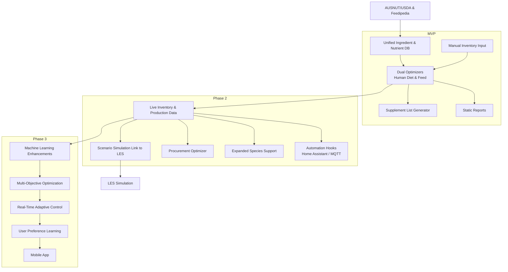

# Farm-to-Plate-and-Pond Optimizer Roadmap from https://github.com/chboishabba/Aquaponics-Calculator/blob/master/docs/roadmap.md

The roadmap outlines phased development for integrating diet and feed optimisation with live environmental simulation (LES) and nutrient databases.

This diagram also serves as an elevator pitch visual, showing how nutrient data and LES integrate through each phase.

## Phase Details

### MVP (Phase&nbsp;1)

- Unified ingredient and nutrient database combining AUSNUT, USDA FDC, Feedipedia and aquaculture tables
- Basic dual optimizers for human diet planning and feed formulation sharing a common inventory
- Manual inventory input with expected harvest fields
- Simple supplement list generator outlining off‑farm needs
- Static reports summarising diet and feed plans with self‑sufficiency metrics

### Phase 2 – Live Data & Automation Hooks

- Live inventory and production integration pulling data from Aquaponics‑Calculator and LES forecasts
- Scenario simulation link to push plans into LES and evaluate environmental impacts
- Procurement optimizer comparing suppliers, prices and lead times
- Expanded species support covering multiple personas and animal types
- Home Assistant / MQTT hooks to automate aeration, feeding and dosing

### Phase 3 – Predictive & AI‑Enhanced

- Machine learning enhancements to predict yield shortfalls and fill missing nutrient data
- Multi‑objective optimisation balancing cost, sustainability and nutrient adequacy
- Real‑time adaptive control re‑optimising plans as conditions change
- User preference learning for tailored menu and feed suggestions
- Mobile app with offline mode for remote decision support
