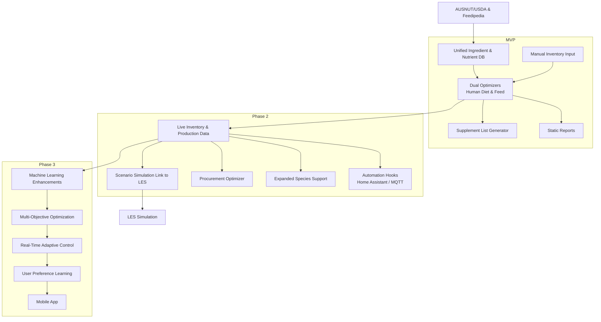

LES = **Living Environment Simulator**
It’s our umbrella system for modelling **dynamic environmental progression** over time, including:

* **Weather patterns & climate data** (temperature, rainfall, wind, solar radiation).
* **Soil, hydrology & erosion** models.
* **Plant growth & succession** (forests, crops, aquaponics plants).
* **Animal population dynamics** (wildlife, livestock, aquaculture species).
* **Nutrient flows** between water, soil, plants, and animals.
* **Impact modelling** of interventions (e.g., planting windbreaks, changing feed, altering stocking density).

In our architecture:

* **Aquaponics-Calculator** is a *module* inside LES that focuses on **controlled water-based systems** (fish tanks, grow beds).
* LES is the *world engine* that can model both **inside-farm** (aquaponics, greenhouse) and **outside-farm** (pasture, forest, watershed) conditions.

This means:

* Diet & feed optimisation → changes ingredient sourcing → LES can simulate **knock-on environmental effects** (e.g., growing more duckweed reduces nutrient discharge into pond → improves oxygen saturation → changes fish growth curve).
* LES outputs → inform diet/feed optimiser constraints (e.g., predicted lower tomato yield → adjust meal plans, recommend alternative crops).


# 🌍 Living Environment Simulator (LES)

**Part of the Living Environment Platform**
*A modular, multi‑scale, feedback‑aware simulation framework that couples atmosphere, hydrology, geomorphology, vegetation, wildlife, and human systems — designed for research, planning, and interactive visualization.*


---

## 🔎 Overview

**LES** aims to close the gap between siloed scientific models (weather, erosion, ecology) and interactive engines (games/visualization). It provides a **coupling layer**, **common data model**, and **plug‑in API** so specialist process models can exchange state **bidirectionally** on consistent spatial/temporal grids — fast enough for exploratory scenarios, accurate enough for scientific workflows.

**Primary use‑cases**

* Forest/landscape evolution under storms, droughts, wildfire, and management.
* Catchment hydrology: rainfall–runoff–sediment–nutrients with vegetation feedbacks.
* Habitat & wildlife dynamics tied to terrain change and climate variability.
* Decision support: restoration plans, floodplain design, erosion risk, fire mitigation.
* Educational/interactive “living world” demonstrators.

---


## 🎯 Goals & Non‑Goals

**Goals**

* **Modular**: each physical/biological process is a replaceable module.
* **Multi‑scale**: hours→centuries; meters→basins; support grid nesting.
* **Bidirectional coupling**: vegetation ↔ erosion ↔ microclimate ↔ hydrology ↔ wildlife.
* **Reproducible**: CF/UDUNITS‑compliant metadata, deterministic runs, versioned inputs.
* **Performant**: Python orchestrator path (prototyping) and HPC path (MPI/ESMF) from day one.
* **Open**: permissive license, documented APIs, test datasets, example scenarios.

**Non‑Goals**

* A monolithic “one model to rule them all.” LES is a **framework** + curated modules.
* Perfect global climate fidelity; LES focuses on **meso/local** scales and coupling. But who knows!!

---

## 🧩 Architecture

```
+-----------------------------+       +-----------------------------+
|  Visualization / Frontends  | <---- |   Data Services (I/O, GIS)  |
|  • Web maps (deck.gl)       |       |   • Raster/Vector adapters   |
|  • Unreal/Unity bridge      |       |   • NetCDF/Zarr stores       |
+---------------^-------------+       +---------------^-------------+
                |                                 |
        +-------+---------------------------------+------+
        |          LES Orchestrator / Scheduler          |
        |  • Time manager  • Event bus  • Couplers       |
        |  • State registry (xarray)  • Unit/CF checks   |
        +--+---------------+-------------------+--------+
           |               |                   |
     +-----+-----+   +-----+-----+       +-----+-----+
     | Atmosphere |   |  Land/Soil|       | Hydrology |
     |  (Weather) |   |  & Veg    |       | (Surface/ |
     |            |   |           |       |  GW)      |
     +-----+------+   +-----+-----+       +-----+-----+
           |               |                   |
        +--+---------------+-------------------+--+
        |        Geomorphology / Erosion / Rivers  |
        +--+---------------+-------------------+--+
           |               |                   |
        +--+--+        +---+---+           +---+---+
        | Fire |        | Wildlife|         | Human  |
        |      |        | Agents  |         | Systems|
        +------+        +---------+         +--------+
```

### Orchestrator

* **Time manager**: discrete timesteps with sub‑stepping; adaptive where supported.
* **Couplers**: sequential or concurrent exchange with **conservative remapping** (area/flow preserving). Options: LES native coupler (xarray+Dask) or HPC coupler (ESMF/ESMPy, OpenMI, BMI adapters).
* **State registry**: shared **xarray** datasets with CF‑conventions; variable naming schema (e.g., `veg.canopy_cover`, `hyd.q_surface`, `atm.precip_rate`).
* **Event bus**: ZeroMQ/gRPC for module messages (e.g., fire ignition, management actions).

### Module API (LES‑BMI)

Minimal interface (inspired by **CSDMS BMI**):

* `initialize(config)` → returns capability flags (grid type, dt range, variables read/write).
* `update(dt)` → advances internal state; exposes `get_value(var)` / `set_value(var)`.
* `finalize()`
* Grid/mesh getters; CRS; metadata; checkpoint/restore hooks.

---

## 📦 Process Modules (first‑class citizens)

**Atmosphere**

* *Options*: Stochastic weather generator; WRF downscaled inputs; ERA5 reanalysis ingestion.
* *Exchanges*: precip, short/longwave radiation, wind, air T/RH, P.

**Hydrology**

* *Surface*: kinematic/kinematic‑wave or shallow‑water (Saint‑Venant) approximations.
* *Subsurface*: bucket/Richards‑lite soil moisture; TOPMODEL‑style runoff indices.
* *Exchanges*: infiltration, runoff, baseflow, soil moisture, ET components.

**Geomorphology / Erosion**

* Hillslope diffusion + stream power law; Exner sediment continuity.
* Channel hydraulics (bank shear stress, critical Shields number), sediment transport rating curves.
* *Exchanges*: updated DEM, sediment fluxes, bank stability → feeds habitat & vegetation.

**Vegetation / Ecosystem**

* Two tracks:

  1. **Procedural‑growth forest** (multi‑scale canopy competition à la “Natural Forest Growth” simulators) for interactive runs.
  2. **Biophysical DGVM‑lite** (LPJ‑style NPP, LAI, phenology, mortality) for climate sensitivity.
* *Exchanges*: canopy cover, root depth, roughness, litter, transpiration, shade, soil binding.

**Wildlife / Agents**

* Agent‑based movement (correlated random walk / step‑selection) with habitat suitability maps; energetic budgets and predation/grazing.
* *Exchanges*: grazing pressure, seed dispersal, disturbance, carcass nutrients.

**Fire (optional)**

* Empirical spread model (ROS from wind, slope, fuel moisture); crown vs surface fire; post‑fire mortality.
* *Exchanges*: canopy loss, soil hydrophobicity, smoke forcing.

**Human Systems (optional)**

* Land‑use transitions, management actions (thinning, planting, levees), water withdrawals/returns.

---

## 🧮 Numerics & Algorithms (baseline choices)

**Time stepping & coupling**

* **Operator splitting** with **sequential coupling** by default (A→B→C in a super‑step), with configurable **exchange frequency** per variable.
* Optional **concurrent/MPI** mode for HPC modules.

**Spatial discretization**

* Regular lat/lon or projected **rectilinear grids**; optional unstructured meshes via ESMF.
* **Nested grids** for hotspots (e.g., high‑res floodplain in coarse basin).

**Key formulations**

* Rainfall–runoff: Green–Ampt infiltration; Unit Hydrograph or Muskingum routing.
* ET: Penman–Monteith; canopy resistance from LAI & VPD.
* Hillslope: linear diffusion; channels: stream‑power incision ($E = K Q^m S^n$).
* Sediment: Exner: $\partial(\eta)/\partial t + (1/(1-\lambda_p))\nabla\cdot q_s = 0$.
* Vegetation light competition: Beer–Lambert; photosynthesis–respiration balance for NPP.
* Wildlife movement: step‑selection with resource selection functions (RSF); density‑dependent mortality.

**Units/metadata**

* **UDUNITS**; **CF‑1.x** variable names/attributes; **ISO‑8601** time. CRS via **PROJ/CRS‑WKT**.

---

## 🗂 GIS & Plans Intake

* **Raster**: Cloud‑Optimized GeoTIFF/GeoTIFF, NetCDF/GRIB and chunked Zarr stores ingested with **rioxarray/xarray**.
* **Vector**: **GeoPackage** and **FlatGeobuf** layers via **GeoPandas** (legacy Shapefile tolerated).
* **Catalogs**: **STAC** entries with optional caching to local Zarr/Parquet for reproducibility.
* **Plans**: **IFC/DWG/DXF** site plans converted (ifcopenshell/FME/QGIS) to GeoPackage layers; optional 3D path IFC → CityJSON/CityGML → Cesium 3D Tiles for visualization. Information loss outside native BIM is documented.
* **CRS policy**: all inputs reprojected to the scenario CRS and tagged with metadata; outputs remain **CF/UDUNITS** compliant.
* **Processing queue**: headless **QGIS Processing**/**GDAL** steps recompute derived rasters (slope, buffers, least‑cost paths) on demand.

---

## 🧭 Planning & Decision Support

* **Scenario manager**: YAML definitions of interventions and levers (planting density, setbacks, detention basins, stocking rates).
* **Multi‑criteria evaluation / geodesign**: weighted raster overlays and constraint maps built with **xarray+Dask** map algebra.
* **Optimisation**: multi‑objective solvers (e.g., **NSGA‑II**, **CP‑SAT**) explore trade‑offs among cost, erosion, habitat, yield.
* **Probabilistic reasoning**: **Bayesian networks** and risk models consume GIS layers and simulation outputs.
* **Agent‑based models**: movement and behaviour driven by GIS suitability rasters and network layers for wildlife or human agents.

Results feed closed‑loop controllers, diet/feed planners, and stakeholder dashboards.

---

## ⚙️ Execution & Visualization

* **Prototype mode**: Python orchestrator with **xarray+Dask** and headless **QGIS Processing** for geoprocessing.
* **HPC mode**: **ESMF/ESMPy** or **OpenMI** coupling on MPI for parallel modules with conservative remapping.
* **Visualization**: ParaView/QGIS for analysis; **Cesium 3D Tiles** or WebGL maps for interactive digital‑twin views.
* **Scenario UI**: sliders and dashboards driving YAML configurations for exploratory planning sessions.

---

## ✅ Current State of Play (SOTP) & SOTA Snapshot

**SOTP (what practitioners do today)**

* Run **specialist models** separately (WRF for weather; SWAT/MIKE SHE for hydrology; CAESAR‑Lisflood/LSDTopoTools for erosion; LPJ‑GUESS/SORTIE‑ND for vegetation; GAMA/HexSim for wildlife), then **hand‑off** static layers between them with coarse temporal sync.
* Limited **two‑way feedback**; high effort for data wrangling; results hard to visualize interactively.

**SOTA exemplars (by domain)**

* **Coupling frameworks**: **ESMF/ESMPy**, **OpenMI**, **CSDMS BMI**; coastal stacks like **MOSSCO**.
* **Atmosphere**: **WRF**, **OpenIFS+SURFEX** (downscaling, data assimilation).
* **Hydrology**: **MIKE SHE**, **Delft3D**, **SWAT+** (catchment to coastal coupling).
* **Geomorphology**: **Landlab** (composable Python components), **CAESAR‑Lisflood** (long‑term morphodynamics).
* **Vegetation**: **LPJ‑GUESS** (DGVM), **SORTIE‑ND** (forest gap dynamics), high‑performance **procedural forest growth** models for interactive scaling.
* **Wildlife**: **HexSim**, **GAMA** (spatial ABMs with GIS).

**Where LES advances**

* **Real‑time, multi‑domain coupling** with **bidirectional** exchanges at controllable frequencies.
* A **unified state registry** (xarray) with CF metadata to minimize glue code.
* **Two execution paths**: rapid Python+Dask prototyping **and** HPC MPI coupling for heavy runs.
* **Bridges to interactive engines**, enabling explainable scenario exploration.

---

## 🧪 Validation, Calibration, QA

* **Golden scenarios**: canonical test basins and forest plots with published benchmarks.
* **Regression tests**: numerical tolerances on time series and maps (pytest + xarray tests).
* **Calibration**: GLUE/Bayesian (e.g., `emcee`) parameter inference; Sobol sensitivity.
* **Uncertainty**: ensemble runs; propagate input/weather uncertainty to outputs.

---

## 🛠 Implementation Plan

**Code layout (suggested)**

```
les/
  core/            # orchestrator, scheduler, couplers, registry
  api/             # LES-BMI adapters, typing, metadata
  modules/
    atm/ hydro/ geomorph/ veg/ wildlife/ fire/ human/
  io/
    readers/ writers/ catalogs/
  viz/
    webmaps/ ue_bridge/
  scenarios/
    demo_catchment/
  tests/
```

**Language/tooling (suggested)**

* **Python 3.11+** (orchestrator): xarray, Dask, numba, cupy(optional), esmpy.
* **HPC modules**: C++/Fortran with BMI shims (C ABI) + MPI.
* **Messaging**: ZeroMQ/gRPC; **Config**: OmegaConf/YAML; **Env**: conda/mamba; **CI**: GitHub Actions.

---

## 🧭 Roadmap

**v0.1 – Minimal Coupled Demo (3–6 weeks)**

* Orchestrator (sequential coupling), CF/units checks, NetCDF/Zarr I/O.
* Modules: stochastic weather → hydrology (runoff/infiltration) → vegetation (canopy/ET) → erosion (hillslope+stream‑power).
* Demo scenario: 10×10 km catchment, 50 m grid, 5‑year run; basic web map and notebook.

**v0.2 – Bidirectional Feedbacks + Wildlife**

* Vegetation ↔ erosion feedbacks (root reinforcement, soil binding, roughness).
* Wildlife ABM prototype (grazing pressure, seed dispersal); habitat suitability from veg+hydro.
* Scenario manager + sliders; improved visualization.

**v0.3 – HPC Path & Nesting**

* ESMF/ESMPy coupler; optional MPI concurrency; nested grid support.
* Import WRF/ERA5 forcing; add Muskingum routing; better sediment transport.

**v0.4 – Fire & Management**

* Fire spread module; post‑fire hydrology changes; management actions API (thinning, planting).

**v1.0 – Stable API & Docs**

* Formal LES‑BMI 1.0 spec; plugin registry; gallery of validated scenarios; provenance/lineage tracking.

---

## 🔗 Interfaces & Example Config

**LES‑BMI variables** (illustrative)

* `atm.precip_rate` \[kg m-2 s-1], `atm.tair` \[K], `atm.rsw` \[W m-2]
* `hyd.theta_soil` \[m3 m-3], `hyd.q_surf` \[m2 s-1]
* `geom.eta` \[m], `geom.q_sed` \[kg m-1 s-1]
* `veg.lai` \[m2 m-2], `veg.canopy_cover` \[0..1], `veg.root_depth` \[m]
* `wild.grazing` \[kg m-2 s-1]

**Scenario YAML (excerpt)**

```yaml
scenario:
  name: hillslope_restoration
  grid:
    proj: EPSG:28356
    dx: 50
    dy: 50
    nx: 200
    ny: 200
  time:
    start: 2000-01-01
    end: 2010-01-01
    dt_seconds: 3600
  modules:
    atmosphere: { kind: stochastic_weather, params: { mean_rain_mm_day: 2.3 } }
    hydrology:  { kind: kinematic_wave }
    vegetation: { kind: procedural_forest, params: { species: [euc, acacia] } }
    geomorph:   { kind: stream_power, params: { K: 3.0e-6, m: 0.5, n: 1.0 } }
    wildlife:   { kind: grazing_abm, enabled: false }
  outputs:
    cadence_hours: 24
    variables: ["hyd.q_surf","geom.eta","veg.lai"]
```

---

## 🔒 Reproducibility & Provenance

* **Run manifests** (YAML) capture git SHAs, module versions, parameter hashes, input catalogs.
* **Determinism**: seeded RNG; numeric tolerances documented.
* **Lineage**: write **Provenance** JSON alongside outputs for audit trails.

---

## 🧑‍🤝‍🧑 Governance & Contributing

* **Module maintainers** for each domain; **API stewards** for LES‑BMI.
* Contribution guide covers variable naming, units, grid specs, testing minima, and review checklists.
* Code of Conduct applies across repos.

---

## 📜 License

Apache‑2.0 (proposed) to enable wide academic/industry adoption while protecting trademarks.

---

## 📚 References & Prior Art (non‑exhaustive)

* Coupling & frameworks: ESMF/ESMPy, OpenMI, CSDMS BMI, MOSSCO.
* Hydrology & morphodynamics: SWAT+, MIKE SHE, Delft3D, Landlab, CAESAR‑Lisflood, LSDTopoTools.
* Vegetation: LPJ‑GUESS, SORTIE‑ND; interactive procedural forest growth literature.
* Wildlife ABM: HexSim, GAMA; step‑selection and RSF methods.
* Visualization: ParaView, deck.gl, Unreal/Unity environmental pipelines.

---

**LES** turns a collection of excellent single‑domain models into a coherent, feedback‑aware system. If you build (or port) a module, start with the **LES‑BMI** adapter template and one of the **golden scenarios** to verify coupling and units. Ready to grow a living world? 🌱


# Farm-to-Plate-and-Pond Optimizer Roadmap from https://github.com/chboishabba/Aquaponics-Calculator/blob/master/docs/roadmap.md

The roadmap outlines phased development for integrating diet and feed optimisation with live environmental simulation (LES) and nutrient databases.



This diagram also serves as an elevator pitch visual, showing how nutrient data and LES integrate through each phase.

## Phase Details

### MVP (Phase&nbsp;1)

- Unified ingredient and nutrient database combining AUSNUT, USDA FDC, Feedipedia and aquaculture tables
- Basic dual optimizers for human diet planning and feed formulation sharing a common inventory
- Manual inventory input with expected harvest fields
- Simple supplement list generator outlining off‑farm needs
- Static reports summarising diet and feed plans with self‑sufficiency metrics

### Phase 2 – Live Data & Automation Hooks

- Live inventory and production integration pulling data from Aquaponics‑Calculator and LES forecasts
- Scenario simulation link to push plans into LES and evaluate environmental impacts
- Procurement optimizer comparing suppliers, prices and lead times
- Expanded species support covering multiple personas and animal types
- Home Assistant / MQTT hooks to automate aeration, feeding and dosing

### Phase 3 – Predictive & AI‑Enhanced

- Machine learning enhancements to predict yield shortfalls and fill missing nutrient data
- Multi‑objective optimisation balancing cost, sustainability and nutrient adequacy
- Real‑time adaptive control re‑optimising plans as conditions change
- User preference learning for tailored menu and feed suggestions
- Mobile app with offline mode for remote decision support


If we want this to stand out and actually work as **the** farm-to-plate-and-pond planner, the “must-haves” break down into five core feature clusters — anything less and we’re just reinventing one of the partial tools you listed.

---

## **1. Unified Ingredient & Nutrient Database**

**Why:** Everything downstream depends on accurate nutrient vectors and availability.

* ✅ **Single source of truth** for both human foods and feed ingredients.
* ✅ Support for **nutrient profiles** (macro, micro, amino acids, fatty acids, bioavailability modifiers).
* ✅ Source tags (`on_farm`, `supplier`, `wild_harvest`).
* ✅ **Seasonal yield forecasts** (from LES & Aquaponics-Calculator).
* ✅ Processing loss factors (cooking, drying, fermentation).

---

## **2. Dual Optimizers (Human Diet + Feed)**

**Why:** This is our differentiator — coupling human nutrition and animal/fish nutrition into one optimisation loop.

* **Human menu optimizer**

  * Meets RDI/NRV for chosen personas.
  * Enforces preferences (veg, allergies, cultural).
  * Maximises use of on-farm harvest.
  * Minimises cost / off-farm purchases.
  * Variety and meal-structure constraints.

* **Animal/fish feed optimizer**

  * Meets species-specific nutrient needs (digestible basis).
  * Applies inclusion caps (e.g., max % duckweed, azolla).
  * Minimises cost and waste.
  * Matches pellet/binder requirements.

* Both optimizers **share the same ingredient pool** and respect total inventory limits.

---

## **3. Inventory & Production Integration**

**Why:** You can’t optimise if you don’t know what’s coming in.

* Automatic import of **real-time inventory** from farm systems.
* Integration with **forecast modules** (plant growth, harvest dates, biomass models for fish).
* Yield uncertainty modelling (so the optimizer can plan for ± scenarios).
* Ability to log and adjust **unexpected events** (disease, crop failure).

---

## **4. Supplement & Procurement Planner**

**Why:** Tells you exactly what to buy to meet nutrition gaps.

* Generates **shopping list** of supplements/off-farm ingredients.
* Calculates **cheapest local source** or **preferred supplier**.
* Suggests **on-farm production adjustments** to reduce reliance on purchased items long-term.

---

## **5. Feedback & Scenario Loop**

**Why:** Links to LES for “what if” planning.

* Export diet/feed plans to **LES** for environmental impact modelling (water use, nutrient cycling, oxygen demand).
* Re-run optimisation under different scenarios:

  * Reduced sunlight (weather event)
  * Loss of specific crop
  * Higher/lower fish stocking density
  * Price spikes in purchased ingredients
* Reports KPIs: % self-sufficiency, cost, nutrient adequacy, sustainability score.

---

## **Nice-to-Haves (but not day-one critical)**

* 📈 **GHG and energy footprint** calculations.
* 🤖 ML-assisted menu/feed suggestions based on past choices and feedback.
* 🧪 HACCP-style safety logging for critical control points.
* 📱 Mobile app interface for quick adjustments on the go.
* 🌦 Weather integration for seasonal planting and yield forecasting.
* 🐟 Oxygen budget calculation tied to Home Assistant automation.

---


There are a few categories of tools that touch parts of what we’re describing, but we're trying to cover the **whole “design human diets + animal/fish feed from on-farm production with supplement top-ups”** loop out of the box.

Here’s the landscape:

---

## **1. Human diet formulation tools**

These do menu planning, but usually ignore feed loops and farm production constraints.

| Tool                                | Strengths                                                                         | Gaps for Our Use                                                          |
| ----------------------------------- | --------------------------------------------------------------------------------- | ------------------------------------------------------------------------- |
| **Cronometer** (pro)                | Tracks nutrients vs RDI, can export CSV, supports custom foods.                   | No optimization, no link to farm inventory, manual data entry heavy.      |
| **Open Food Facts + Nutrient DBs**  | Massive open food composition database.                                           | Just data; no menu optimization or cost modelling.                        |
| **ESHA Food Processor / NutriBase** | Professional diet analysis & planning, supports custom ingredients.               | Expensive, closed-source, no farm integration, no feed coupling.          |
| **NutriSurvey**                     | Free, used in nutrition projects, basic linear programming for diet optimization. | Designed for humanitarian contexts; limited to human diets, manual setup. |
| **Optimeal**                        | Pet/human diet optimization, nutrient balancing.                                  | Proprietary, narrow species focus, no multi-species coupling.             |

---

## **2. Livestock/fish feed formulation**

These focus on least-cost ration formulation but don’t consider human diets or shared resource planning.

| Tool                                                                  | Strengths                                             | Gaps for Our Use                                                           |
| --------------------------------------------------------------------- | ----------------------------------------------------- | -------------------------------------------------------------------------- |
| **WinFeed**                                                           | Windows app, least-cost formulation, can handle fish. | Closed-source, manual ingredient input, no integration with crops/harvest. |
| **BestMix / Format International**                                    | Industry-grade formulation software.                  | Expensive, locked-in, no farm-scale coupling.                              |
| **AquaFeed Formulation Software (various)**                           | Targeted to aquaculture species.                      | Proprietary, no human diet features, no on-farm resource matching.         |
| **Open Forage Ration Balancers** (DairyNZ, Feedipedia + spreadsheets) | Open data, known formulas.                            | Manual, species-limited, no central orchestrator.                          |

---

## **3. Farm resource planners**

These manage inventory/yields but not nutrient optimization.

| Tool                         | Strengths                                        | Gaps for Our Use                 |
| ---------------------------- | ------------------------------------------------ | -------------------------------- |
| **OpenFarm**                 | Open API for plant growing info.                 | No yield-to-diet integration.    |
| **Tend / Agrivi / FarmLogs** | Crop planning, yield tracking.                   | No diet/feed optimization layer. |
| **OpenAgInitiative**         | Community-driven controlled environment ag data. | Early stage; not an optimizer.   |

---

## **4. Research / academic prototypes**

Some projects come close conceptually:

* **FAO’s Diet Problem Linear Programming Spreadsheets** — Excel LP models for least-cost human diets with local foods.
* **Nutrient Optimiser** — open-source nutrient density tool, some LP diet functions.
* **Feedipedia + linear programming** — used in animal nutrition teaching.
* **SustainFarm project tools** — model integration of crop-livestock production for sustainability, but not interactive.

---

## **What’s Missing (Our Niche)**

We want one platform that:

* Pulls **real-time and forecast inventory** from farm production (LES/Aquaponics-Calculator).
* Uses **nutrient composition tables** for both human food and feed ingredients.
* Runs **multi-objective optimization** for:

  * Human diet plans that hit RDI and preferences.
  * Animal/fish feed formulas that hit species requirements.
* Minimizes **off-farm supplement purchases**.
* Feeds outputs into **LES scenarios** and **real-world automation**.

None of the tools above do all of this — the closest is to combine:

* Open nutrient DBs (AUSNUT, USDA FDC, Feedipedia).
* Open LP solvers (PuLP, OR-Tools, SciPy).
* Our existing **Aquaponics-Calculator** + LES data model.

---
Because we are cohabitating with our domesticated animals, we work on the presumption of ourselves as the active catalyst within the einvornment, and thus treat it as two tightly-coupled planners as a beginning point:

1. human **food design** (menus/recipes) using what you grow, topped up with supplements;
2. **feed design** for your fish (and plants via nutrient dosing), using on-farm inputs + targeted amino/mineral adds.

I’ll lay out goals, data you need, the optimization models, and how it plugs into your Aquaponics-Calculator + LES stack.

# What we’re building

* A **least-cost, nutrient-complete** *menu builder* for humans and *feed formulator* for fish, both driven by **what’s actually available on the farm** (seasonal harvests, yields) with the option to **buy only the gaps**.
* It runs weekly: ingests inventory & expected harvests → proposes menus/feeds that meet targets (nutrient RDIs / species requirements) → outputs **shopping/supplement list** + **production tasks**.

# Core datasets (add these tables)

* `ingredients` (humans) / `feed_ingredients` (fish): name, unit, cost/kg, **nutrient vector** (see below), allergens, processing losses (%), stock\_on\_hand, lead\_time, source={farm, supplier}.
* `nutrients`: id, name, unit, upper/lower bounds per **persona** (humans) or **species+life\_stage** (fish).
* `recipes` (humans): many-to-many `recipe_items` with grams per serving; processing: yield factor, cook loss (protein, vit C, etc.).
* `menus`: 7-day plan mapping people → recipes.
* `feed_formulas`: inclusion rates (% DM) → pellet size → daily ration by biomass.
* `harvest_forecasts`: item, expected\_kg, availability\_window.
* `supplements`: amino acids (lysine, methionine, threonine), vitamins/minerals, salt mix, oils.
* `constraints`: user prefs (vegan, allergies), cultural constraints, max inclusion rates (e.g., **duckweed ≤ 30% DM**, **BSFL ≤ 20% DM**, **azolla ≤ 15% DM** unless proven).

## Nutrient vectors

* **Humans**: energy, protein, **DIAAS** adj. protein, fat, n-6, n-3 (ALA/EPA/DHA), carbs, fibre, Ca, Fe (heme/non-heme), Zn, Mg, K, Na, I, Se, Cu, Mn, B12, folate, choline, vit A (RAE), D, E, K, C, B1/2/3/5/6/7. Include **bioavailability modifiers** (e.g., phytate → Fe/Zn).
* **Fish (tilapia/trout as examples)**: energy (MJ/kg), digestible protein, essential AAs (Lys, Met+Cys, Thr, Trp, Arg, Ile, Leu, Val, His, Phe+Tyr), lipid (n-3 HUFA targets for species), starch limit, fibre limit, Ca, P (digestible), NaCl, vitamin premix, ash max.

# Optimization models

## A) Human menus (weekly)

**Decision vars**

* $x_{i,d,m}$ grams of ingredient *i* used on day *d*, meal *m* (or recipe servings $y_{r,d,m}$).

**Objective**

* Minimize **purchased cost** $\sum c_i \cdot \max(0, \text{use}_i - \text{farm}_i)$
  or multi-objective: *cost – λ·farm\_utilization + μ·GHG\_intensity reduction*.

**Constraints**

* Nutrient coverage per person/day:
  $L_k \le \sum_i n_{ik} \cdot x_{i,d,\*} \le U_k$ for all nutrients *k*.
* Inventory & harvest windows:
  $\sum_{d} x_{i,d,\*} \le \text{stock}_i + \text{harvest}_i$.
* Meal structure (e.g., 3 meals/day), max prep time per day, kitchen capacity (optional).
* Dietary prefs: allergens $x_{i,\*,\*}=0$, vegetarian etc.
* Processing losses: apply yield matrices to cooked recipes.
* Variety/acceptability (soft): minimum distinct recipes per week, cap repeats.

**Solvers**

* Start with **OR-Tools CP-SAT** or linear programming (PuLP/OR-Tools LP); add integer vars for recipe servings.

## B) Fish feed formulation (batch)

**Decision vars**

* $z_j$ inclusion fraction of feed ingredient *j* (DM basis).

**Objective**

* Least cost: minimize $\sum_j c_j z_j$.

**Constraints**

* Target nutrient ranges (digestible basis):
  $L_a \le \sum_j AA_{ja} z_j \le U_a$ (for all essential amino acids),
  lipid range, fibre max, starch max, **Ca\:P digestible ratio**, ash max.
* Functional caps: e.g., **BSFL oil ≤ x%**, **duckweed ≤ y%**, **azolla ≤ y%**, **microalgae** inclusion for EPA/DHA.
* Pellet physics (optional): sum binders ≥ min, moisture target.
* Regularization (palatability): keep big changes small vs last formula (ℓ1 penalty).

**Solvers**

* Pure LP with bounds; switch to **QP** if you add smoothness penalties.

### C) Coupling with operations

* Daily ration $R = f(BW, T, SGR)$ → from your TGC growth model.
* Check **oxygen budget** vs planned feed; bump aeration if needed (your HA automation).

# On-farm ingredient strategy (what to grow/produce)

* **Protein**: duckweed, azolla, water spinach, microgreens; **BSF larvae** (on farm waste); **red wrigglers**; legumes (if space).
* **Lipids (n-3)**: microalgae (Nannochloropsis), flax/chia (ALA) + small **fish oil** supplement for HUFA (species dependent).
* **Minerals**: eggshell → CaCO₃; Mg via Epsom salt; K via ash/K₂SO₄; Fe chelate for plants.
* **Human staples**: leafy greens, herbs, tomatoes, peppers, cucumbers; grains/pulses optionally off-farm.
* **Processing**: fermentations (tempeh/koji) to boost **DIAAS**, reduce antinutrients; sprouting for vit C/folate; solar dehydration for shelf-stable veg powders.

# Bioavailability & safety

* Apply **phytate\:Zn** and **phytate\:Fe** penalty functions to adjust effective intake.
* **HACCP** steps for feed/food: critical control points (water activity, pH after fermentation, storage temps, mycotoxin risk in BSF/feeds), traceability logs.

# How this plugs into your stack

**Aquaponics-Calculator**

* Add endpoints: `/optimize/human-menu`, `/optimize/fish-feed`.
* Ingest: `harvest_forecasts`, `ingredients`, `nutrients`, `supplements`, `prices`.
* Emit: menu PDFs/shopping list; feed formula + pellet batch sheet.
* Tie to **alerts**: if optimizer requires off-farm purchase > threshold, flag “deficit” and suggest which crop/supplement closes the gap.

**LES (Environment Simulator)**

* Scenario linkage: change planting density → changes expected harvest → changes feasible menu/feed space; conversely, nutrition targets can imply required cropland/bed area.
* Water/N balance: feed protein → TAN load → plant uptake requirement; close loops automatically.

# Minimal viable feature set (2 sprints)

**Sprint 1**

* Data model + ingestion (AUSNUT/USDA FoodData Central for humans; feed tables for fish + your on-farm items).
* LP feed formulator (tilapia starter/grower/finisher as a template).
* Menu LP for 1 adult persona; cost + farm-first objective.
* Exporter: shopping list (off-farm) + harvest utilization plan.

**Sprint 2**

* Processing losses & DIAAS adjustment; phytate penalty.
* TGC-driven ration + oxygen budget check → HA aeration target.
* Preference/variety constraints, simple weekly UI.
* “What to plant next” recommender: marginal gain in menu/feed feasibility per crop m².

# Example: tiny LP (fish feed) in math

Minimize $\sum_j c_j z_j$
s.t.

* $\sum_j z_j = 1$
* Protein: $\sum_j DP_j z_j \ge 0.34$ (34% DP grower)
* Lys: $\sum_j Lys_j z_j \ge 0.018$
* Met+Cys: $\sum_j MetCys_j z_j \ge 0.009$
* Lipid: $0.08 \le \sum_j Fat_j z_j \le 0.12$
* Fibre: $\sum_j Fibre_j z_j \le 0.06$
* Digestible P: $\sum_j dP_j z_j \ge 0.006$
* BSFL ≤ 0.20, Duckweed ≤ 0.30, Azolla ≤ 0.15, Binder ≥ 0.03.

# Example: weekly human menu (sketch)

* Personas: Adult M 10.5 MJ, Adult F 8.5 MJ.
* Hard constraints: protein ≥ 1.0 g/kg BW; Ca ≥ 1000 mg; Fe ≥ 8/18 mg (sex-specific); B12 ≥ 2.4 µg; omega-3 ALA ≥ 1.6/1.1 g; sodium ≤ 2 g.
* Farm inputs favored: lettuce, basil, cherry tomato, kale, tilapia, duckweed powder, microgreens, eggs, herbs.
* Optimizer proposes meals; **supplement list** might be: iodized salt, B12 (if mainly plant-based), Vit D in winter, small fish oil for DHA/EPA if desired.

# Safety & compliance

* Keep human nutrition targets aligned with **NHMRC (Australia) NRVs**;
  fish feed targets from species literature; log sources in metadata.
* Label allergens, maintain traceability for every batch.


Here’s a side-by-side framing of **our Aquaponics-Calculator + Environment Simulator** vs. a variety of plant/gardening data APIs.

---

## **Scope & Purpose**

|                      | **Our Stack**                                                                                                     | **Listed APIs (Perenual, Verdantly, etc.)**                                             |
| -------------------- | ----------------------------------------------------------------------------------------------------------------- | --------------------------------------------------------------------------------------- |
| **Primary domain**   | Dynamic simulation + monitoring of live systems (water chemistry, fish/plant growth, weather, erosion, wildlife). | Static botanical/cultivation metadata — species traits, planting advice, climate zones. |
| **Use case**         | Real-time control, forecasting, decision support for aquaponics, aquaculture, and larger landscape models.        | Garden planning, plant identification, care scheduling, species databases.              |
| **Integration role** | Acts as the *engine* + *data manager* for live operations.                                                        | Acts as a *reference library* or enrichment source for species data.                    |

---

## **Data Model**

|                            | **Our Stack**                                                                                                               | **Listed APIs**                                                                     |
| -------------------------- | --------------------------------------------------------------------------------------------------------------------------- | ----------------------------------------------------------------------------------- |
| **Entities**               | Species + live stock batches, sensors, water chemistry readings, feed logs, growth records, hardware, events.               | Species + static attributes (soil type, watering needs, hardiness, flowering time). |
| **Temporal aspect**        | Time-series, high-frequency sensor logs, calculated KPIs, forecasts.                                                        | Mostly static; some seasonal planting windows.                                      |
| **Environmental coupling** | Yes — pH/temp/DO affect plant/fish growth; environment simulator couples weather, hydrology, erosion, vegetation, wildlife. | Indirect — climate zone tags; no continuous environmental feedback.                 |

---

## **Technical Depth**

|                | **Our Stack**                                                                             | **Listed APIs**                                              |
| -------------- | ----------------------------------------------------------------------------------------- | ------------------------------------------------------------ |
| **Analytics**  | FCR, SGR, nutrient balances, DO saturation, NH₃ toxicity, erosion rates, habitat changes. | Minimal; mostly filter/search functions.                     |
| **Simulation** | Multi-domain coupling (weather, hydrology, geomorphology, vegetation, wildlife).          | None; purely data retrieval.                                 |
| **Automation** | Hooks to Home Assistant/MQTT for actuators (aeration, dosing, feeding).                   | None; external systems must decide what to do with the data. |

---

## **Where They Complement Us**

* **Species trait enrichment**:
  We could pull from **Perenual, APIFarmer, Trefle** to populate our `species` table with growth ranges, tolerances, nutrient needs, and phenology.
* **Garden planning intelligence**:
  Verdantly-style recommendations could be an “advisory layer” in our dashboard for selecting compatible crops or plants in aquaponics beds.
* **Climate zone mapping**:
  APIs with USDA/FAO zone data could pre-set defaults in scenarios for the Environment Simulator.

---

## **Where We Surpass Them**

* Live feedback loops (sensor data → analytics → control).
* Multi-species, multi-domain simulation.
* Direct actuation for real-world systems.
* Scenario forecasting (what-if storms, droughts, feed changes).

---

## **Integration Example**

Imagine LES + Aquaponics-Calculator running a simulated or real system:

1. **Species data import** from APIFarmer → populate plant nutrient uptake and tolerance.
2. **Weather forcing** from WRF or ERA5.
3. **Simulation loop**:

   * Forecast evapotranspiration & nutrient loads.
   * Adjust irrigation/nutrient dosing via Home Assistant.
4. **Visualize** growth progression and environmental impact over months/years.

---
